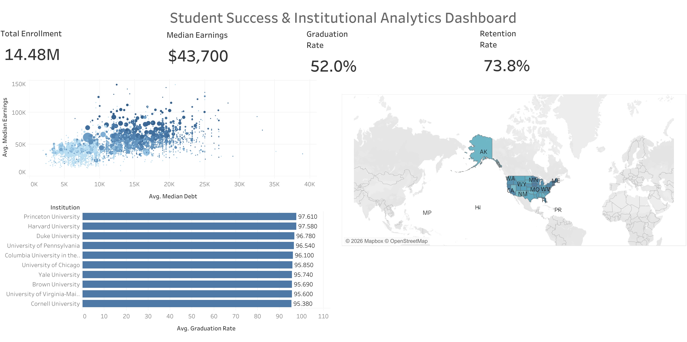

# Student Success & Institutional Analytics Dashboard

## Overview

An interactive Tableau dashboard analyzing student success metrics across U.S. institutions.

### Key Metrics

- Total Enrollment
- Median Earnings
- Graduation Rate
- Retention Rate

### Visualizations

- State-wise Graduation Rate Map
- Earnings vs Debt Analysis
- Top Universities by Graduation Rate

### Interactive Features

- State-level filtering
- Dynamic KPI updates
- Cross-dashboard filtering

### Tableau Public Dashboard

https://public.tableau.com/app/profile/manya.eleti4437/viz/StudentSuccessInstitutionalAnalyticsDashboard/StudentSuccessDashboard

---
Built using Tableau Public.
